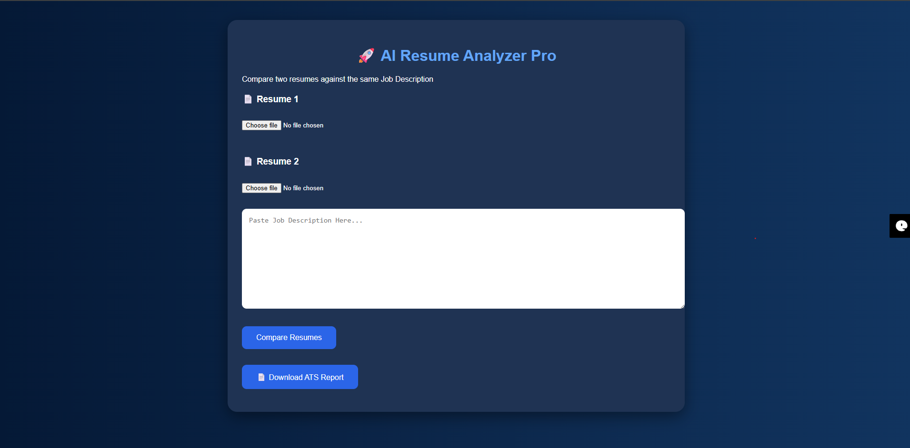
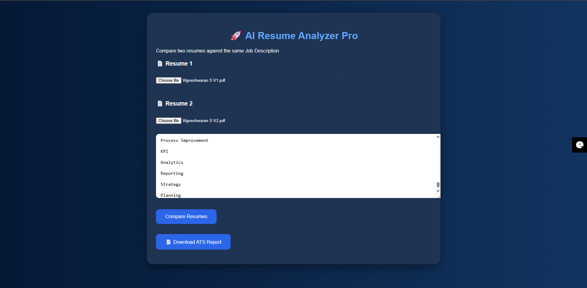
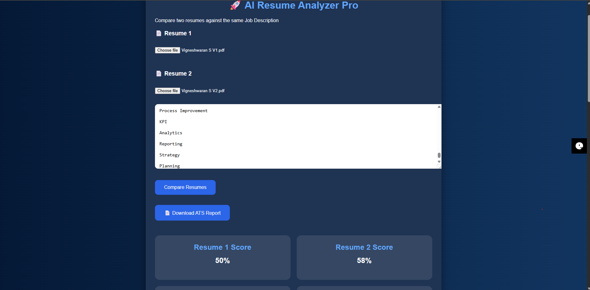

# 🚀 AI Resume Analyzer Pro

AI Resume Analyzer Pro is a JavaScript-based ATS (Applicant Tracking System) Resume Analysis and Resume Comparison Tool.

## Features

✅ Upload PDF Resume

✅ Extract Resume Content using PDF.js

✅ ATS Keyword Matching

✅ ATS Score Calculation

✅ Missing Skills Detection

✅ Resume Quality Analysis

✅ Interview Chance Prediction

✅ Compare Two Resume Versions

✅ Recommend Best Resume

✅ Download ATS Report

---

## Technologies Used

- HTML5
- CSS3
- JavaScript
- PDF.js

---

## How It Works

1. Upload Resume 1
2. Upload Resume 2
3. Paste Job Description
4. Click Compare Resumes
5. View ATS Scores
6. Review Missing Skills
7. Select Recommended Resume

---

## Project Screenshots

### Home Screen

### Resume Upload

### ATS Analysis Result

## Author

Vigneshwaran S

Creative Operations | Project Management | AI Solutions
Last Updated: July 2026

LinkedIn:
https://www.linkedin.com/in/vigneshwaran-s-creativemanager/

Location:
Bengaluru, India
